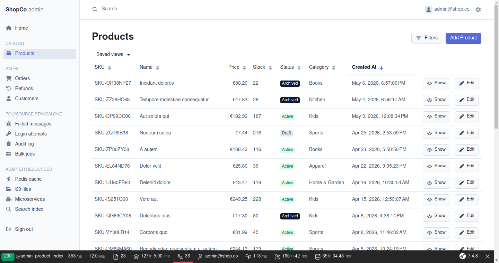
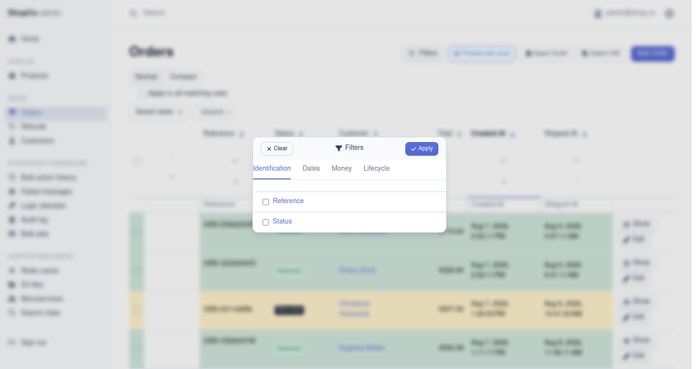
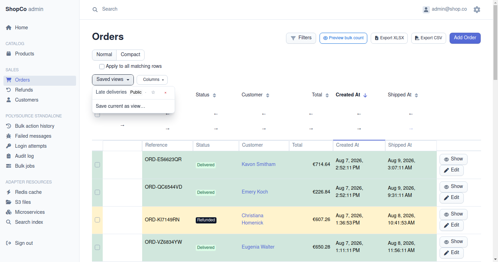
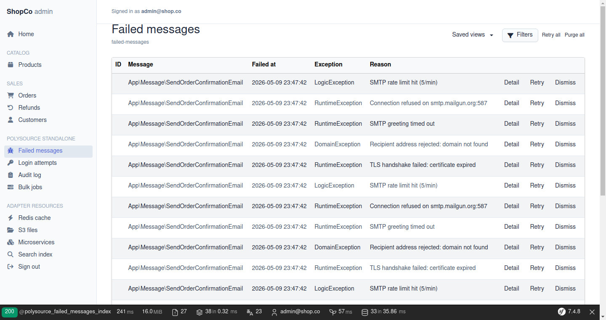
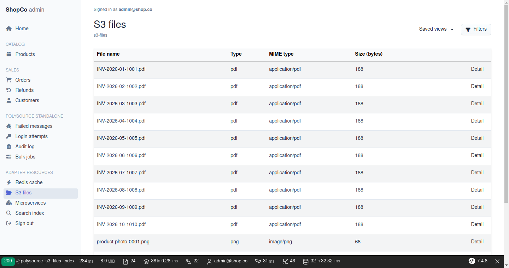

# Polysource

[](https://packagist.org/packages/polysource/symfony-bundle)
[](https://github.com/polysource/polysource/actions/workflows/ci.yml)
[](https://packagist.org/packages/polysource/core)
[](./LICENSE)

> **Admin anything from Symfony — and bring your own everything.**



Polysource is two products built on the same primitives, MIT-licensed, running side by side in the same app:

1. **The EasyAdmin filter bridge** — drop it next to your existing EasyAdmin install (4.24+ or 5.0+) and your listings gain the UX below. Zero fork, zero config.
2. **The standalone admin engine** — admin for resources that *aren't* Doctrine entities: Messenger failed messages, Redis keys, files on S3, external REST APIs, Meilisearch indexes.

---

## You already run EasyAdmin → the filter bridge

```bash
composer require polysource/easyadmin-filter-bridge
```

That one `composer require` — no config, no template change — upgrades every index page:

| | EasyAdmin alone | with the bridge |
|---|---|---|
| Filter modal | flat field list | **tabs + group accordions** (server-rendered, zero JS) |
| Active filters | invisible until you reopen the modal | **chips bar** above the table, one-click remove |
| Views | — | **saved views** — per-user / per-team / public, default `★` per user |
| Columns | fixed | **per-user visibility + reordering + widths** |
| Export | — | **filter-aware streaming CSV / XLSX** |
| Sharing a filtered list | copy a 400-char URL | **short URL tokens** |
| Row details | — | **expandable per-row panels** — lazy-loaded, per-row permission, no-JS fallback |

Plus: session-persisted filters per CRUD, 8 enhanced built-in filter types, 4 custom filters (`Between`/`In`/`NotNull`/`FullText`), filter-from-cell menu, per-column quick filter row, frozen columns, row density toggle, conditional row styles, bulk dry-run counts, toasts, keyboard-shortcuts panel, [expandable row details](./docs/user/easyadmin-filter-bridge/row-details.md) (per-entity providers, lazy fragment, even a nested Polysource listing as the panel). Everything is opt-in per page, [themable via CSS variables](./docs/user/easyadmin-filter-bridge/theming.md), translated (en/fr), and CSP-friendly (no inline CSS/JS).

<table>
<tr>
<td width="50%"></td>
<td width="50%"></td>
</tr>
<tr>
<td align="center"><em>Filter modal — tabs + groups, no JavaScript required</em></td>
<td align="center"><em>Saved views — private / team / public</em></td>
</tr>
</table>

Every feature has a server-side baseline ([ADR-027](./docs/adr/0027-progressive-enhancement.md)): it all works before a single line of JavaScript loads. Honest per-filter comparison vs upstream EA: [whats-new.md](./docs/user/easyadmin-filter-bridge/whats-new.md). Walkthrough: [getting started](./docs/user/easyadmin-filter-bridge/getting-started.md).

## You need to admin things outside Doctrine → the standalone engine

```bash
composer require polysource/symfony-bundle polysource/adapter-messenger
```

The contract a resource must satisfy is **3 read methods + 3 write methods** — no Doctrine inheritance, no entity manager. Once satisfied, every capability applies uniformly: filters, saved views, [expandable row details](./docs/user/row-details.md), audit trail, async bulk actions, search palette, dashboard widgets, workflow integration.

<table>
<tr>
<td width="50%"></td>
<td width="50%"></td>
</tr>
<tr>
<td align="center"><em>Messenger failed transport — browse, retry, dismiss, purge</em></td>
<td align="center"><em>Files on S3 via Flysystem — same UX, same filters</em></td>
</tr>
</table>

**6 adapters ready** (Doctrine cohabitation, Messenger, Redis, S3/Flysystem, HTTP REST, Meilisearch — each ~80-300 LOC and a model for the next one you'll write), plus the opt-in capability packages: Cmd+K cross-resource search, dashboard widgets, async bulk with live Mercure progress + mid-flight cancel, GDPR Art. 30 / HIPAA audit trail, Symfony Workflow integration, field/action/resource-level permissions — down to **per-record action gating** (your voters receive the row's `DataRecord` as subject). Row details work on every adapter (`HasRowDetailsInterface`), including a **nested Polysource listing as the panel** (`RowDetail::listing()`).

## See it run in 5 minutes

```bash
git clone https://github.com/polysource/polysource && cd polysource
make showcase       # http://localhost:8084 — every capability live (login on the page)
```

Full stack: PHP 8.4 + Symfony 7.4 LTS + EasyAdmin 5 + Postgres + Redis + Mercure + Meilisearch + MinIO. Smaller focused demos: `make demo-bridge` (EA 5 host), `make demo-bridge-v4` (EA 4 / Sf 6.4 floor), `make demo-filter` (no EasyAdmin at all), `make demo` (Messenger dashboard). Guided tour with screenshots: [showcase-tour.md](./docs/user/showcase-tour.md).

## Why Polysource

Symfony's admin landscape is mature for one shape of resource: a Doctrine ORM entity with a CRUD lifecycle. Anything else — a queue, a feature flag, a file on S3, an upstream API, a search index — sits outside that shape. Polysource starts from the other end: satisfy a 6-method contract, and every capability applies to **whatever** the resource is. That's why one admin handles your products table AND your failed transport AND your Redis flags AND your search index — one auth model, one audit trail, one progress tracker.

## Bring your own everything

**Most contracts are 1-5 methods** — that's the design budget; past 5 we open an ADR ([ADR-010](./docs/adr/0010-core-api-surface-criterion.md)).

| You want to… | Implement | Methods | Time |
|---|---|---|---|
| Admin a new data source (Stripe, your microservice, a queue) | `DataSourceInterface` | **3** read + 3 write | 1-2 hours |
| Plug a custom backend into Cmd+K search | `SearchProviderInterface` | **3** | 30 min |
| Pipe the audit log to Splunk / Datadog / a SIEM | `AuditLoggerInterface` | **1** | 15 min |
| Render a custom dashboard tile | `WidgetInterface` | **5** | 1 hour |
| Persist saved views in Redis instead of Doctrine | `SavedViewStorageInterface` | **5** | 1 hour |
| Replace the permission backend (LDAP / OPA / custom voter) | `PermissionInterface` | **1** | 15 min |
| Custom HTTP pagination (Link headers, RFC 5988…) | `PaginationStrategyInterface` | **2** | 30 min |
| Format a filter chip your way | `ChipFormatterInterface` | **1** | 10 min |
| Ship a self-contained capability bundle | `AdminPluginInterface` + `#[AsPlugin]` | **3 metadata** | 1 hour |

**No global registries, no XML, no magic** — every extension is a Symfony service tag scanned by `tagged_iterator(...)`. Full map with sample code: [extensibility.md](./docs/user/extensibility.md) · Cookbook: [build your own adapter](./docs/user/cookbook/build-your-own-adapter.md).

## What it is **not**

- **Not a fork of EasyAdmin.** EA is excellent for Doctrine CRUD; we don't try to replace it. The bridge enriches it without forking.
- **Not a frontal competitor on Doctrine.** For pure Doctrine entities, keep using EasyAdmin. `polysource/adapter-doctrine` exists for cohabitation, not replacement.
- **Not a no-code internal-tool builder** (use Retool / Appsmith for that).
- **Not a BI dashboard** (use Grafana / Metabase).
- **Not a SaaS** — self-hosted Symfony packages, MIT-licensed.

## Quality bar

- **1256 unit + functional tests** and **28 integration tests** (real kernel + SQLite) in the package matrix
- **47 browser E2E tests** (Symfony Panther) + **24 showcase WebTestCase tests** + **15 adapter real-container tests** (Redis / Meilisearch / MinIO / WireMock) on every push
- **PHPStan level max** across all packages · **PHP-CS-Fixer** PSR-12 + Symfony rules
- **Core coverage gate ≥ 90%** (`polysource/core` sits at 99%+)
- **CI matrix**: PHP 8.2/8.3/8.4 × Symfony 6.4/7.2/7.4 × EasyAdmin 4.24/5.0, plus a bridge-alone floor smoke (Sf 6.4 + EA 4)

## Status & compatibility

**v1.1.0** — API frozen since v1.0.0 (2026-08-06) per [ADR-018](./docs/adr/0018-admin-plugin-interface-and-public-contracts.md); SemVer applies strictly — breaking changes ship in major versions only, signalled in the [CHANGELOG](./CHANGELOG.md). 16 packages on [Packagist](https://packagist.org/?query=polysource%2F), split automatically from this monorepo ([ADR-026](./docs/adr/0026-monorepo-split-and-packagist-mirrors.md)).

**Baseline** ([ADR-015](./docs/adr/0015-multi-version-compatibility-baseline.md), v1.0 floors per [ADR-011](./docs/adr/0011-pre-v1.0-freeze-checklist.md)): PHP 8.2 → 8.4 · Symfony 6.4 / 7.2 / 7.4 LTS (`^8.0` allowed by constraints, forward-compat, not yet in CI) · EasyAdmin 4.24+ / 5.0+ · Doctrine ORM 2.20+ / 3.6+.

Adopt early with eyes open — the honest limitations list (minimal UI surfaces, field helpers, cursor pagination trade-offs) lives in [docs/user/installation.md](./docs/user/installation.md) and [ADR-028 scope discipline](./docs/adr/0028-scope-discipline.md).

<details>
<summary><strong>The 16 packages</strong></summary>

| Package | What it does |
|---|---|
| `polysource/core` | 38 public types, zero Symfony dep — pure PHP 8.2+ contracts |
| `polysource/filter` | Filter primitives (collection, criteria, session persistence, **saved views**) + shared Stimulus controllers — usable standalone in any Symfony app |
| `polysource/easyadmin-filter-bridge` | Drop-in for EasyAdmin (4.24+ or 5.0+) — enhanced filter types, chips, saved views dropdown, column prefs, expandable row details |
| `polysource/symfony-bundle` | Symfony wiring for the standalone admin: DI, routing, controllers, CSRF, pagination caps, row detail panels |
| `polysource/twig-theme` | Default Bootstrap 5 templates for index/detail/forms/fields/row-detail panels |
| `polysource/adapter-messenger` | Browse + retry / dismiss / retry-all / purge Messenger failed envelopes |
| `polysource/adapter-doctrine` | Doctrine ORM cohabitation case (whitelisted filter properties) |
| `polysource/adapter-redis` | 5 type-pure Redis data sources (string/list/hash/set/sorted-set), SCAN cursor pagination |
| `polysource/adapter-flysystem` | Browse + write files on S3 / local / Azure / GCS via Flysystem |
| `polysource/adapter-http` | Admin external REST APIs via Symfony HttpClient (page-number + cursor strategies) |
| `polysource/adapter-meilisearch` | Browse + write Meilisearch indexes |
| `polysource/audit` | GDPR Art. 30 audit trail (Doctrine storage, CSV export, retention purge) |
| `polysource/bulk-async` | Bulk actions over Messenger with live Mercure progress + cancel mid-flight |
| `polysource/widgets` | Dashboard widgets (KPI counters, top-N lists, sparkline charts) |
| `polysource/search` | Cross-resource search palette (Cmd+K) with fan-out aggregator |
| `polysource/workflow-bridge` | Symfony Workflow integration (auto transition buttons, state chip) |

</details>

## Documentation

[User docs](./docs/user/) · [Installation](./docs/user/installation.md) · [Getting started](./docs/user/getting-started.md) · [Bridge getting started](./docs/user/easyadmin-filter-bridge/getting-started.md) · [Row details (bridge)](./docs/user/easyadmin-filter-bridge/row-details.md) · [Row details (native)](./docs/user/row-details.md) · [Theming](./docs/user/easyadmin-filter-bridge/theming.md) · [i18n](./docs/user/i18n.md) · [Cookbook](./docs/user/cookbook/) · [ADRs](./docs/adr/) · [Roadmap](./ROADMAP.md) · [Changelog](./CHANGELOG.md)

## Contributing

Read [`CONTRIBUTING.md`](./CONTRIBUTING.md). Scope is strict per [ADR-012](./docs/adr/0012-dual-product-positioning.md) and [ADR-028](./docs/adr/0028-scope-discipline.md) — check [product-vision.md](./docs/strategy/product-vision.md) §2 before opening a feature request.

## License

[MIT](./LICENSE)
