# Polysource Showcase — guided tour

> A 16-step walkthrough of `examples/showcase-demo/`, the **ShopCo
> SaaS** application that exercises every Polysource package in a
> single Symfony 7.4 app. Each step embeds the screenshot regenerated
> on every release via `make screenshots` (Phase I pipeline, ADR-025).

This is the canonical "what does Polysource look like deployed" page.
For installation in your own app see [installation.md](./installation.md).
For per-feature deep-dives see the package READMEs under
[`adapters/`](./adapters/), [`audit/`](./audit/), [`workflow-bridge/`](./workflow-bridge/),
[`widgets/`](./widgets/), [`search/`](./search/), [`bulk-async/`](./bulk-async/),
[`filter/`](./filter/), and [`easyadmin-filter-bridge/`](./easyadmin-filter-bridge/).

## Run it locally

```bash
git clone git@github.com:polysource/polysource.git
cd polysource
make showcase            # boots 8 services + loads fixtures
open http://localhost:8084
```

Three demo accounts (password `shopco`):

| Email | Role | Sees |
|---|---|---|
| `admin@shop.co` | `ROLE_ADMIN` | Everything (incl. purge / GDPR export) |
| `ops@shop.co` | `ROLE_OPS` | Reads + retry / cancel / transition |
| `viewer@shop.co` | `ROLE_VIEWER` | Read-only |

## 1 · Sign in

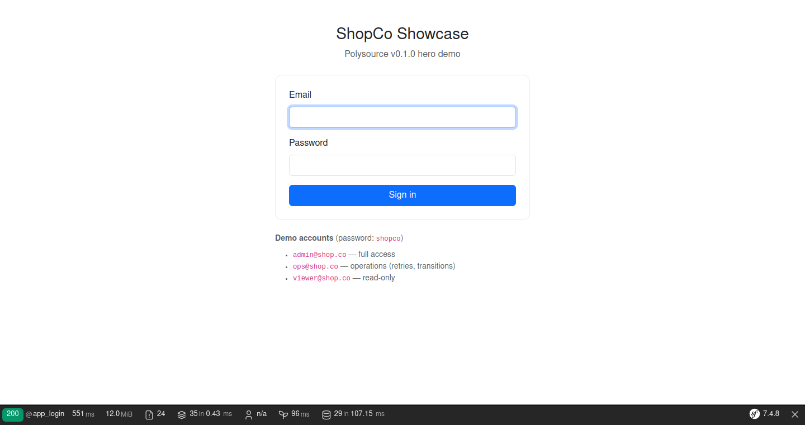

Plain Symfony `form_login`. The 3 demo accounts are pre-seeded
by the Foundry `DefaultUsersStory` (`make showcase` ran the
fixtures for you).

## 2 · Home dashboard — `polysource/widgets`

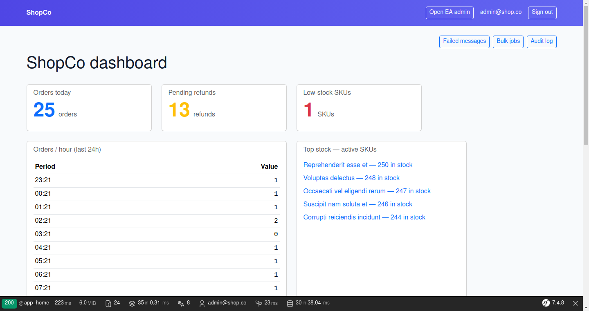

Three Counter widgets (orders today, pending refunds, low-stock
SKUs), one Chart widget (orders/hour last 24h), one List widget
(top stock active SKUs), and a full-width List widget (recent
customers — out of frame). All built from live DB state by
`App\Polysource\Widget\ShopcoDashboardProvider`, registered as a
factory tagged `polysource.widgets.dashboard` so the bundle's
`DashboardRegistry` picks it up.

The toolbar (top right) links to the three high-traffic ops
resources. Hit `Cmd+K` (or `Ctrl+K` / `/`) anywhere to open the
[`polysource/search`](./search/) palette.

## 3-6 · EasyAdmin CRUDs + filter-bridge

The Doctrine side of ShopCo lives in EasyAdmin v5. Polysource's
[`easyadmin-filter-bridge`](./easyadmin-filter-bridge/) auto-tags
8 `FilterEnhancer`s that swap the form-types of standard EA filters
without any per-CRUD code, plus 4 custom filters (`BetweenDateFilter`,
`InFilter`, `NotNullFilter`, `FullTextSearchFilter`) opt-in via
`configureFilters()`.

### Products (200 fixtures, mixed status)


### Customers (500 across 8 EU countries)

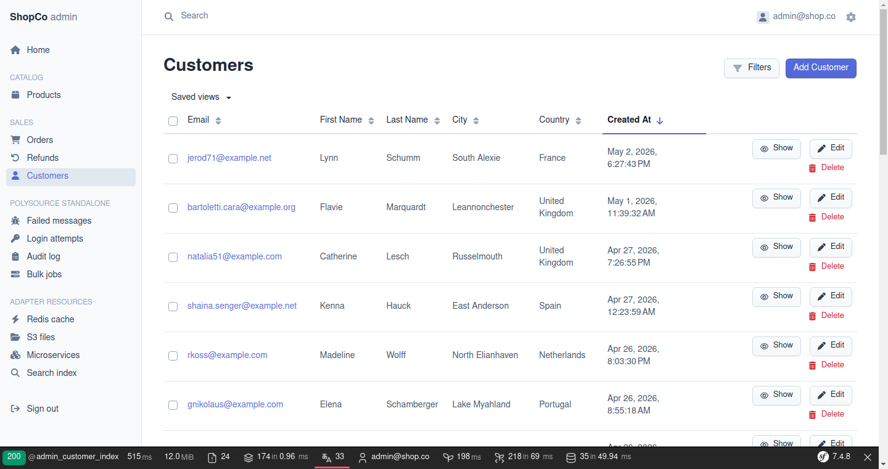

### Orders (1000 spread across the 7 workflow states)


`OrderCrudController` shows off the 4 custom bridge filters. The
underlying `OrderWorkflow` (Symfony state machine, 7 places, 6
transitions) is wired by [`polysource/workflow-bridge`](./workflow-bridge/);
state chips and transition buttons land in a Phase H+1 polish.

### Refunds (61 fixtures, 3 statuses)

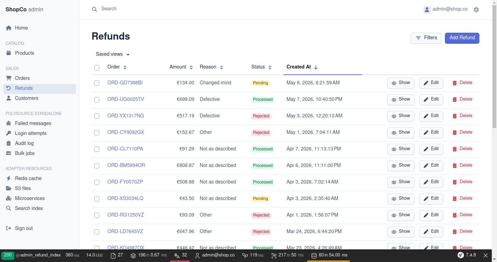

## 7 · Failed messages — `polysource/adapter-messenger`


50 realistic envelopes seeded by `app:seed-failed-messages` across
3 message classes (email SMTP errors, Meilisearch 5xx, payment
webhook timeouts). The Retry / Dismiss / Retry-all / Purge actions
are gated by the `PolysourcePermissionVoter` (Phase D + G).

> v0.1 ships an empty `configureFields()` per ADR-011 — the table
> is functional but row content rendering is the topic of v0.2.
> The detail page renders all DataRecord properties.

## 8 · Login attempts — `polysource/adapter-doctrine` (cohabitation case)

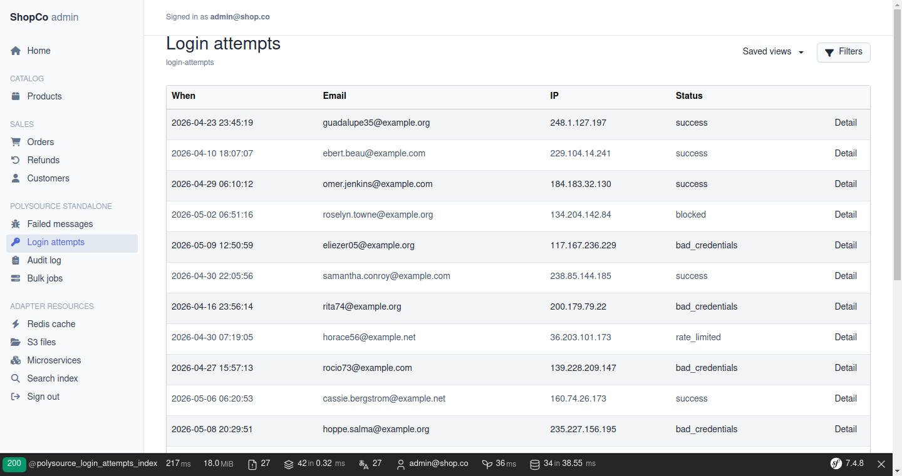

300 attempts seeded over 30 days, including a deliberate
**25-hit credential-stuffing burst** from `203.0.113.42`
(filterable by ip + status). Demonstrates the ADR-012
"Doctrine cohabitation" pattern: the table is written by the
firewall and never mutated, so admining it through EasyAdmin
would be misleading — Polysource exposes it read-only.

## 9 · Audit log — `polysource/audit`

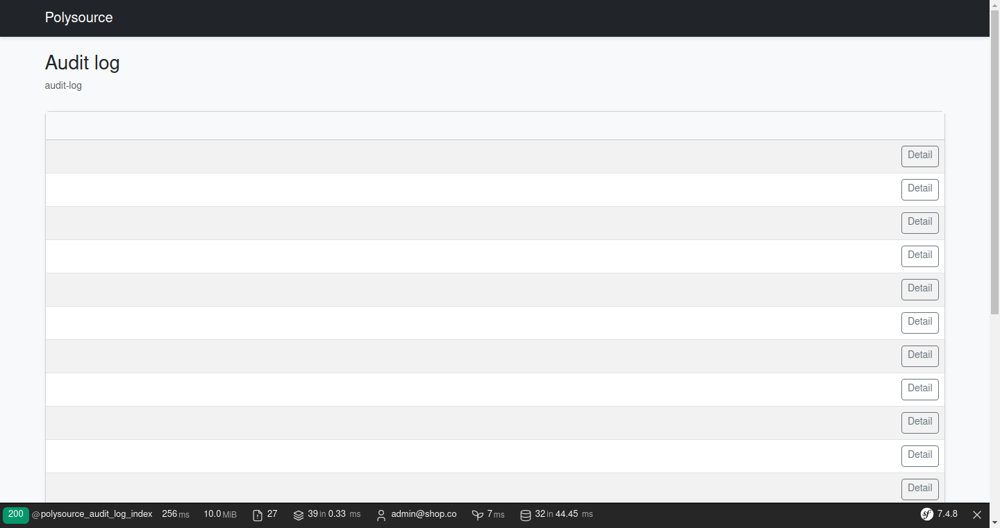

50 entries seeded across 4 actors and 5 resource targets.
`ROLE_ADMIN` sees the **Export CSV** action (GDPR Art. 30,
RFC 4180-conform). `polysource:audit:purge --before` retention
command ships with the package.

## 10 · Bulk jobs — `polysource/bulk-async`

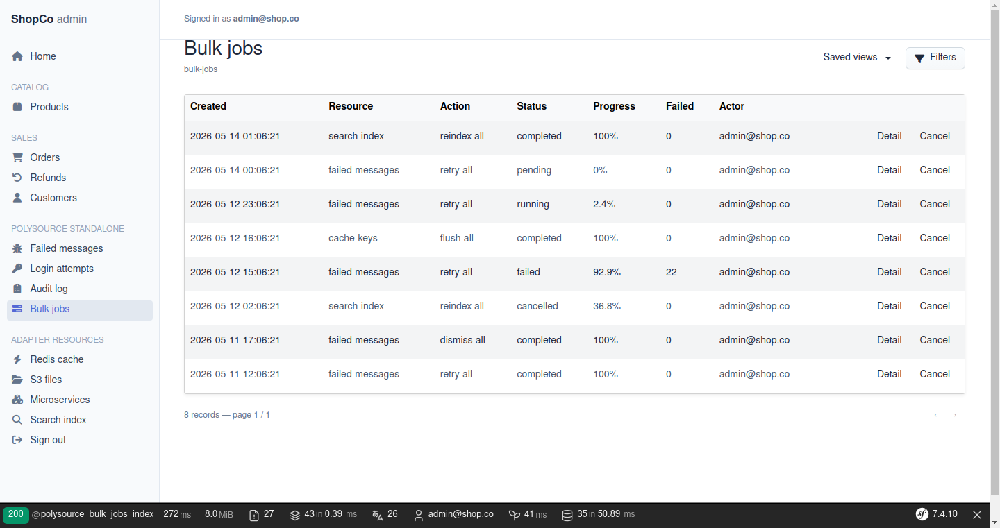

8 jobs covering every `BulkJobStatus`: Pending, Running with
partial progress (3/127), Completed, Failed (290+22 errors),
Cancelled (1842/5000), plus 3 successful retries and reindexes.
Live progress on the detail page is broadcast via Mercure SSE
with a polling fallback (Stimulus controller).

## 11 · Redis cache — `polysource/adapter-redis`

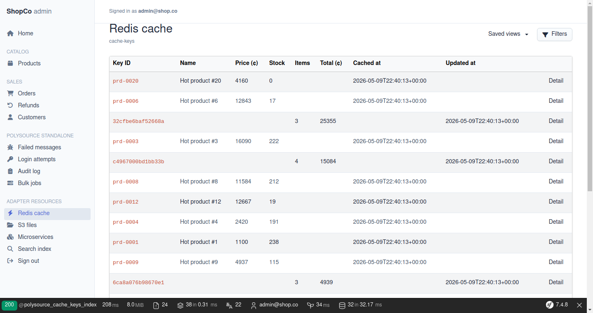

30 hash entries seeded under `shopco:cache:*` (20 product hot-cache
+ 10 cart sessions). Read+write — ops can drop a stale cache entry
without `redis-cli del`.

## 12 · S3 files — `polysource/adapter-flysystem`


10 invoice PDFs + 5 product photos seeded into MinIO via the
AsyncAws S3 client (state-of-the-art async S3 client 2026).

## 13 · Microservices probe — `polysource/adapter-http`

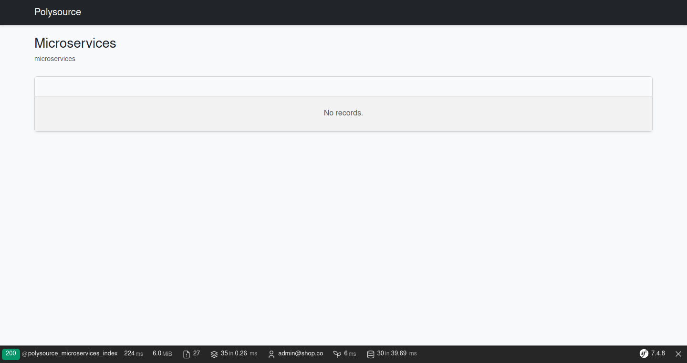

3 internal services (payments, shipping, notifications) simulated
by WireMock. The `HttpDataSource` translates Polysource criteria
to query-string parameters and parses paginated JSON responses.

## 14 · Meilisearch index — `polysource/adapter-meilisearch`

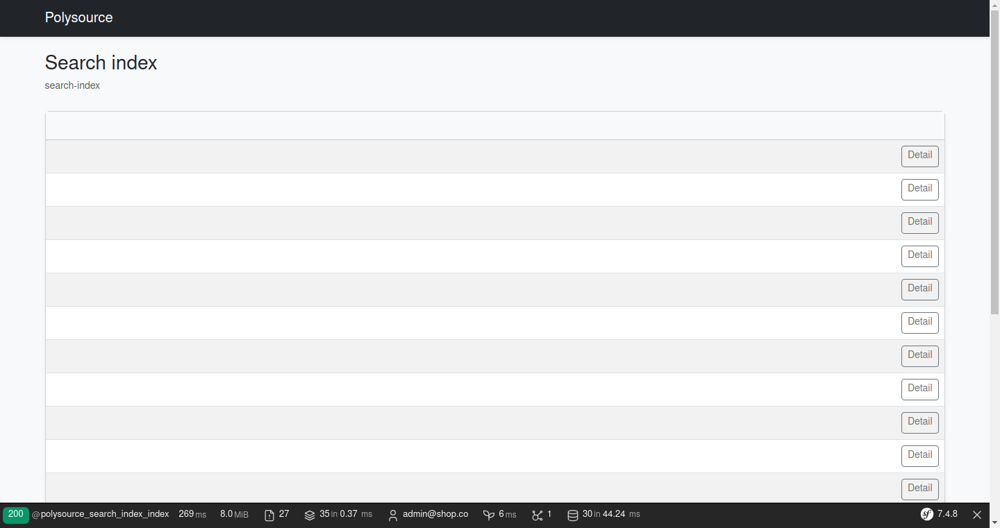

Every Foundry-seeded product is pushed to the `shopco-products`
Meilisearch index by `app:seed-stores`. The DataSource translates
filter criteria to Meilisearch's filter expression syntax with
strict property-whitelisting (anti-injection).

## 15 · Saved views on EasyAdmin — `polysource/easyadmin-filter-bridge`


The bridge adds a **Saved views** dropdown above EasyAdmin's filter
chips bar. Apply once, save with a name, share via URL — the bridge
translates each saved criterion back into the form-type shape EA's
binding expects (BooleanFilter bare scalar, ChoiceFilter array,
between-date envelope) so the redirect lands on a fully-populated
EA index, no glue code per CRUD. Scopes are gated by Symfony's
`SavedViewVoter` (private / team / public).

This is one of the two killer features of the **Produit 1** in the
[dual-product positioning](../adr/0012-dual-product-positioning.md)
— a drop-in for any existing EasyAdmin app (4.24+ or 5.0+), no fork.

## 16 · Filters modal on EasyAdmin — `polysource/easyadmin-filter-bridge`


The bridge replaces EA's inline filter strip with a tabbed modal
(`View / Identification / Dates / Money / Lifecycle` on the Orders
CRUD). Eight `FilterEnhancer`s auto-swap the form-types of standard
EA filters (multi-select for ChoiceFilter, date-presets for DateTime,
between for numeric / date, in for repeated values, full-text for
EntityFilter), and four custom filter types
(`BetweenDateFilter`, `InFilter`, `NotNullFilter`,
`FullTextSearchFilter`) are opt-in via `configureFilters()`. Tabs
group filters by domain so the modal stays scannable on resources
with 15+ filterable columns.

## 17 · Column visibility toggle — `polysource/easyadmin-filter-bridge` (v0.3.0)

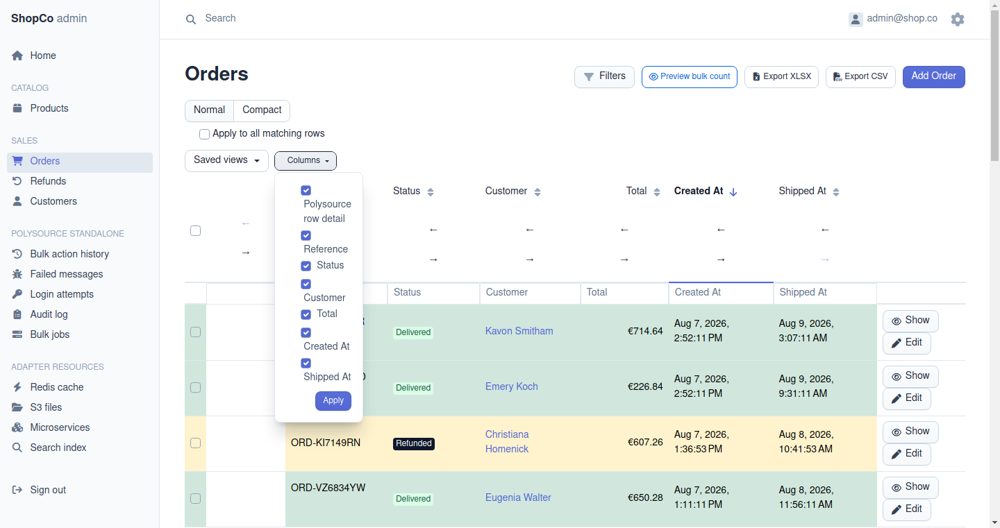

Each EA index page ships a column-visibility dropdown (the `⊞`
trigger next to the saved-views chip). Per-user, per-resource
preferences live in `polysource_column_preferences` and survive
across sessions. The same dropdown exposes the saved-views star
(`★`) for setting a personal default that auto-applies on a
clean URL — distinct from role defaults that admins pre-configure.

## 18 · Row conditional styles — `polysource/easyadmin-filter-bridge` (v0.3.0)


Order rows get coloured by status (`paid` → blue, `cancelled` →
red, `refunded` → yellow, `delivered` → green) via
`polysource_row_class()`. The Twig helper takes the entity
instance + a property + a property-to-class map and emits the
matching Bootstrap utility class on each `<tr>`.

## 19 · Filter from cell value — `polysource/easyadmin-filter-bridge` (v0.4.0)

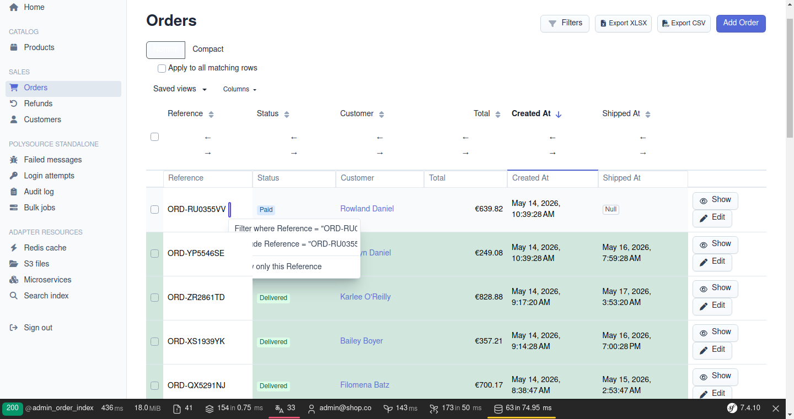

A `⋮` icon next to scalar cells on the `status` / `reference`
columns opens a "Filter where = this / Exclude / Show only this"
dropdown — server-side anchors, no JS required. Each item is a
plain `<a href>` that navigates to the filtered URL.

## 20 · Per-column quick filter row — `polysource/easyadmin-filter-bridge` (v0.4.0)


A second header row carries one `<input name="filters[X]">` per
column with Enter-to-submit. The helper renders a tiny
`<form method="GET">` per column with hidden inputs preserving
every other query parameter, so the user's existing filter slice,
sort, page, and search survive the new input.

## 21 · Cross-page bulk scope toggle — `polysource/easyadmin-filter-bridge` (v0.4.0)


A small "Apply to all matching rows" toggle sits above the table
on every bulk-action-enabled index. When ticked, subsequent
bulk-action POST requests carry `bulk_scope=all_matching` — host
code reads it and runs the action across the full filtered set
instead of just the visible selection. The custom "Mark as
cancelled" bulk action records each invocation in
`polysource_bulk_action_history` for the audit trail (v0.5.0 #8).

## 22 · Frozen columns + saved-view column widths — `polysource/easyadmin-filter-bridge` (v0.5.0 #2 + #10)


The first visible column AND the actions column stay visible
during horizontal scroll via CSS `position: sticky` — useful on
wide listings. The `polysource_column_width_style(view, property)`
helper applies pixel widths persisted on the active SavedView
(via `polysource_active_saved_view()`).

## 23 · Row density toggle — `polysource/easyadmin-filter-bridge` (v0.5.0 #3)

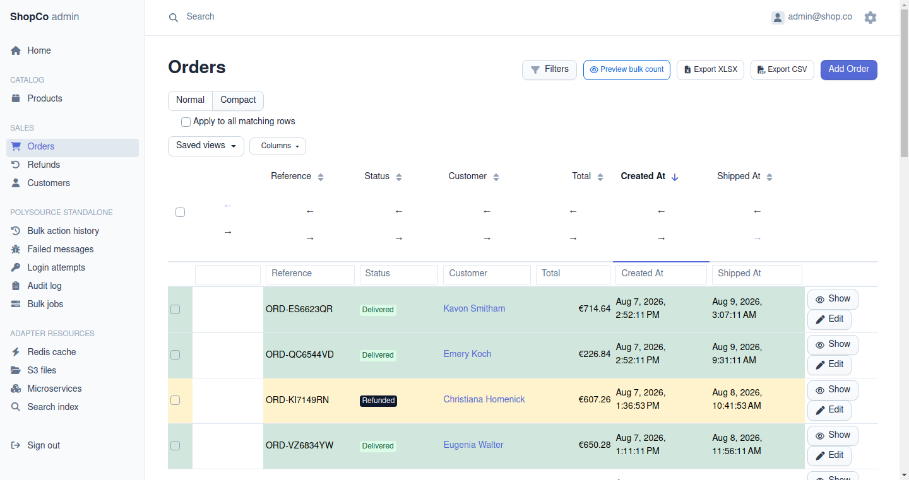

A 2-state compact / normal toggle (anchor pair, preserves every
other query param). Compact reduces cell padding via a
server-side `<style>` block that replicates Bootstrap's
`.table-sm` rules on EA's `.datagrid` class — pure CSS, no JS
(ADR-027).

## 24 · Keyboard shortcuts cheat sheet — `polysource/easyadmin-filter-bridge` (v0.5.0 #5)

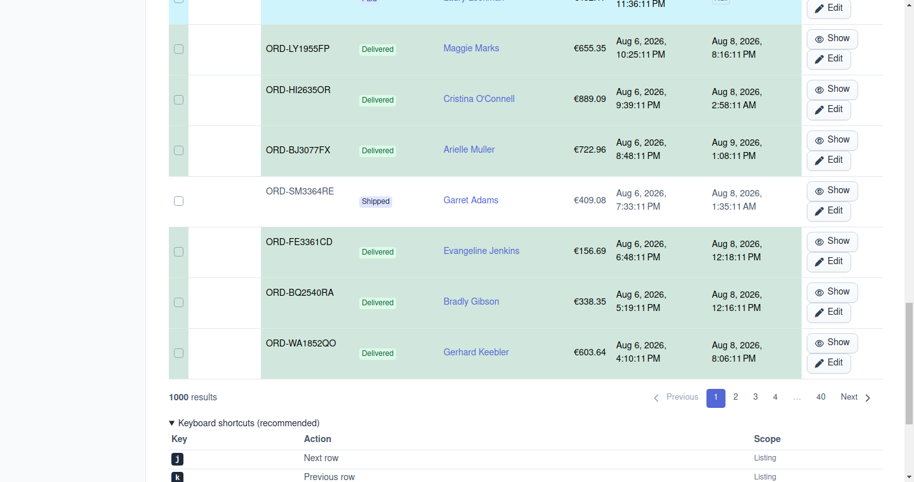

A native `<details>` element at the bottom of every index page,
collapsed by default. Lists the recommended shortcuts (j/k
navigate rows, `/` focus search, `?` toggle help, Esc close
panels, etc.) with `<kbd>` markup. Bindings are host-side via
Stimulus; the cheat sheet displays whether or not the controller
is loaded.

## 25 · Filter URL deep linking — `polysource/easyadmin-filter-bridge` (v0.5.0 #7)

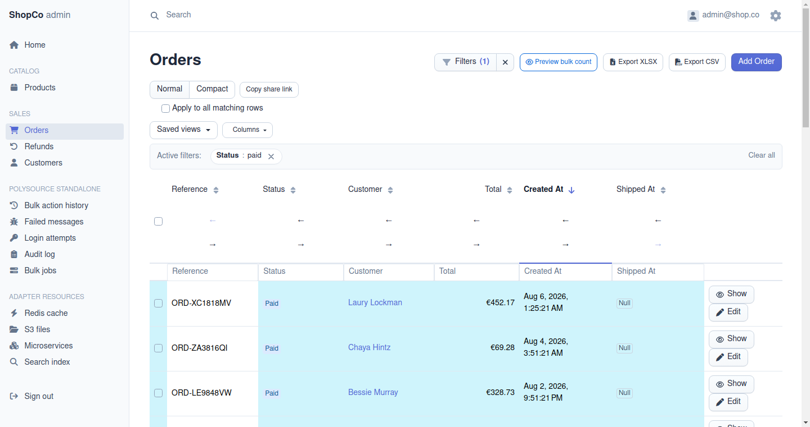

When filters are active, a "Copy share link" button appears in
the header. The href points at the bridge's
`/admin/polysource/f/{token}` redirect — a 12-hex token resolving
back to the full filter slice. Users copy the link without the
URL-length pain of raw `?filters[...]` slices.

## 26 · Column reordering — `polysource/easyadmin-filter-bridge` (v0.5.0 #1)

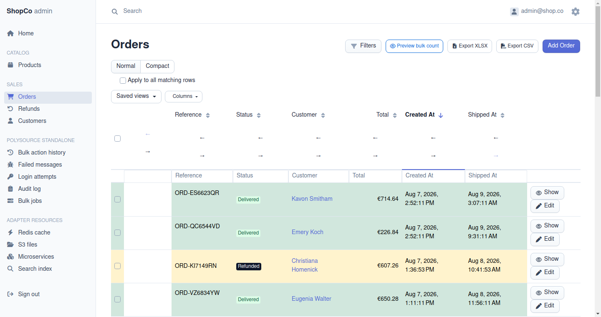

Next to each column header label, two ← → buttons (anchor links
to `/admin/polysource/column-order/{resource}/move`) swap the
column with its neighbour. Order persists on the user's
`ColumnPreference` record. Pure server-side; hosts who want
drag-and-drop layer their own Stimulus controller on top of the
same persistence backend.

## 27 · Backend-only v0.5.0 features (no screenshot — they're API surfaces)

Three v0.5.0 features ship behind API surfaces hosts integrate
in their own controllers / templates and have no canonical
screenshot to capture:

- **Toast notifications** (v0.5.0 #4) —
  `polysource_toasts()` rendered top-right; the screenshot would
  be empty when no flash message is active. Captured indirectly
  through bulk-action workflows.
- **Bulk action history** (v0.5.0 #8) —
  `BulkActionHistoryService::record()` / `recentForResource()`.
  Append-only audit log; admins query it via a host-specific
  endpoint (the showcase doesn't render the log itself).
- **Recently viewed records** (v0.5.0 #6) —
  `RecentRecordsService::recordView()` /
  `recentForCurrentUser()`. The OrderCrudController detail/edit
  actions upsert the MRU list; hosts surface it in a sidebar or
  command palette.
- **Filter-aware export + matching count** (v0.5.0 #9) —
  the export CSV / XLSX buttons in #21 already exercise the
  filter-aware export. The `MatchingCountController` JSON
  endpoint is a programmatic API; no rendered UI to capture.

## Regenerate this tour

```bash
make showcase                    # if not already running
make showcase-screenshots        # captures all PNGs into docs/user/screenshots/
```

The pipeline is committed to the repo so the doc and the code never
drift — see [`examples/showcase-demo/src/Command/ShowcaseScreenshotsCommand.php`](../../examples/showcase-demo/src/Command/ShowcaseScreenshotsCommand.php).

## Why two visual languages?

Reading the tour you may notice that the EasyAdmin pages (steps
3 → 6, 15, 16) and the Polysource pages (steps 7 → 14) don't share
the exact same chrome:

|  | EasyAdmin (Catalog / Sales) | Polysource (standalone + adapters) |
|---|---|---|
| Top bar | Search input + settings cog | Page title + breadcrumb only |
| Column headers | Sort arrows on every column | No sort arrows in v0.1 |
| Status display | Coloured Bootstrap badges | Plain text |
| Action buttons | Icon + label buttons (`Show` / `Edit`) | Plain text links (`Detail` / `Retry` / `Dismiss`) |
| Layout shell | EA's own templates | `@Polysource/index.html.twig` (twig-theme package) |

This is **intentional** per
[ADR-012 dual-product positioning](../adr/0012-dual-product-positioning.md).
EasyAdmin and Polysource are two distinct products that cohabit in
the same Symfony app:

- **EasyAdmin owns its Doctrine CRUDs** with its own templates,
  voters, and form rendering pipeline. Polysource never touches
  them — your existing EA configuration carries through unchanged.
- **Polysource owns its standalone resources** with the
  `polysource/twig-theme` package's templates. They're styled with
  Bootstrap 5 to match a typical Symfony admin, but they don't
  pretend to be EA.

Aligning the two visual languages — sort arrows on Polysource
indexes, button-styled actions, status badges by convention,
optional top search bar — is on the v0.2 roadmap (tracked as a
"polish-shell" help-wanted issue at launch). For v0.1 the priority
was correctness and the architectural separation; the visual gap
is acknowledged here so the reader is not surprised.

If you're integrating Polysource into an existing EA app and want
the two halves to feel uniform on day one, the showcase
(`examples/showcase-demo/templates/`) is the reference for the
layout-override pattern. A dedicated cookbook page is on the v0.2
documentation backlog.

## What this showcase proves

1. **The 16 Polysource packages cohabit** in a single Symfony 7.4
   application (ADR-012 dual-product positioning).
2. **EasyAdmin keeps owning the Doctrine entities** it's good at,
   while Polysource owns everything else.
3. **All six non-Doctrine adapters** (Messenger, Doctrine
   read-only, Redis, Flysystem, HTTP, Meilisearch) browse real data
   without exotic configuration.
4. **The 5 cross-cutting capabilities** (workflow, audit, widgets,
   search palette, bulk-async) plug into the same admin shell
   without forking it.

Continue the deep dive with [installation.md](./installation.md) or
the per-package READMEs linked from the [main index](./README.md).
